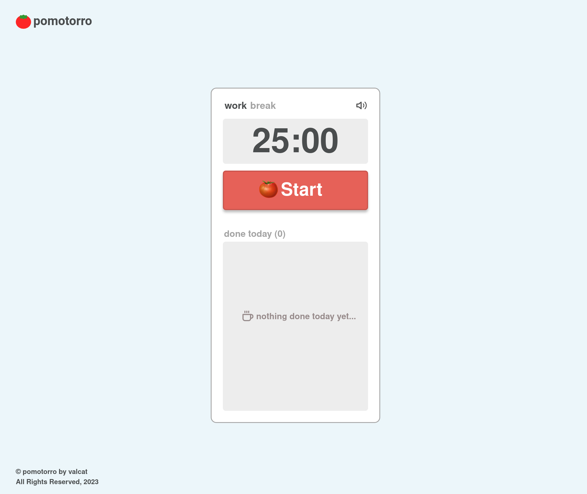

# Pomotorro App

The Pomotorro App is a simple productivity tool based on the Pomodoro Technique, designed to help you manage your time effectively and improve focus and productivity. The Pomodoro Technique involves breaking your work into intervals (typically 25 minutes), followed by a short break.

## Give a try!

➡️ You can access the app [https://pomotorro.com](https://pomotorro.com).

## Features 🚀

- **25-Minute Work Intervals:** Pomotorro offers the classic Pomodoro Technique (a 25-minute work interval followed by a 5-minute break)

- **Task Management:** Pomotorro allows you to organize your work by creating, updating, and deleting tasks. You can easily keep track of your progress for the day.

- **Today's Task List:** The app focuses on the tasks done during the day.

- **Persistent Timer:** Never worry about losing your progress. Pomotorro retains your timer's state even after reloading the page or closing the app.

- **Ticking Sound:** Enhance your concentration by enabling the optional ticking sound during work intervals.

## Local installation and configuration

1. Clone the repository: `git clone git@github.com:valcat/pomotorro-app.git`
2. Navigate to the project directory: `cd pomotorro-app`
3. Install dependencies: `npm install`
4. You can customize session and break duration according to your preferences by modifying the Constants.js file

## Usage

1. Run the app in the development mode: `npm run dev`
2. Open the app in your browser.

## Build

To build the app for production: `npm run build`

## License

This project is open source and available under [the MIT License](./LICENSE).

## Contact

If you have any questions or comments about the project, feel free to reach out to me. I would love to hear from you!
